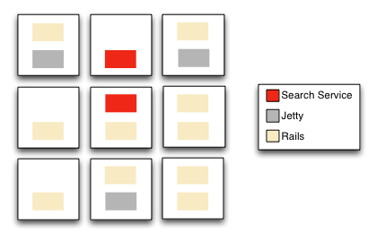

# An Introduction to DevOps
---
## Courtney Faulkner
### June 29, 2016


## Agenda
- What is DevOps, and why?
- Containerization
- Continuous Integration (CI)/ Continuous Delivery (CD)
- Cloud Services
- Clusters
- Infrastructure Automation
- Microservices
- Final consideration


## What is DevOps, and why?
> "DevOps (a clipped compound of "development" and "operations") is a culture, movement or practice that emphasizes the collaboration and communication of both software developers and other information-technology (IT) professionals while automating the process of software delivery and infrastructure changes. It aims at establishing a culture and environment where building, testing, and releasing software, can happen rapidly, frequently, and more reliably."
>
> &mdash; https://en.wikipedia.org/wiki/DevOps


## What is DevOps, and why?
- Expansion of agile and CI/CD pipeline improvement and collaboration
    - Code development with CI/CD
    - Infrastructure automation
    - Deployment automation

Note:
As software complexity creeps up, there is perpetual desire to find new efficiencies to reduce noise and error. More complicated software systems led to ways to package shareable libraries. Shareable libraries led to way to manage their discovery and transitive dependencies. More complex assemblies of these libraries led to advances in build systems. More efficient build systems led to fail-fast continuous integration solutions that allow developers to react to and correct issues more quickly. Now, we're looking to tear down walls between building/testing applications and deploying them.


## What is DevOps, and why?
### Collaboration Areas
- Dev
- QA
- Operations

Note:
Organizations often spend a lot of time configuring and maintaining stable servers that can house the applications, but there has often been a large divide between the people that know what the applications need, and the people that know what the servers provide. Syncing those two areas often involves a lot of error-prone emails, change orders, meetings, and deploy-fail-notify-request access-investigate-locally reproduce-try again cycles. It is not always feasible/cost-effective to run direct analogues of the production environments on laptops or development environments. To make matters more difficult, intricate server configurations and patch releases are fragile if they cannot be codified and reproduced. Plus, manual deployment procedures are equally prone to error if they are not able to be reproduced in an automated way.

Organizations are looking to reduce the amount of attention needed to maintain and share configuration of infrastructure and deployment of code, so that their resources can focus on the parts actually important to their business. Namely, up-time, scalability, testability, time-to-market with new/updated features. DevOps is just an attempt to streamline the pipeline of product inception, development, testing, and deployment across multiple functional areas of an organization.


## What is DevOps, and why?
- Technology areas that can facilitate DevOps
    - Containerization
    - Continuous Integration (CI)/ Continuous Delivery (CD)
    - Cloud Services


## Containerization
- Operating system configuration as code
- Inheritable
- Host and container OSes must be of the same type (linux - linux, Windows - Windows)

&mdash; http://blog.smartbear.com/web-monitoring/why-containers-instead-of-hypervisors/

Note:
Enables configuration of an operating system specific in purpose for a piece of software, such as a Spring Boot web application. It allows machines to be testable and repeatable, independent of the piece of software being written to run in it. Linux Docker hosts are machines that have kernel extensions to share their resources with docker containers at a low level, with programmatic hooks to deploy the docker containers. Docker containers are the transient instantiation of docker images. Docker images are inheritable machines, packaged as slices to allow artifact resolution and low-level library sharing.

VM hypervisors abstract entire machines through emulation, requiring more CPU and RAM resources than containers. Approximately 4-6x as many apps can fit into a container host than a VM host.


## Containerization
- Abstracts the kernel, uses the underlying machine's devices
    - Kernel namespaces (ipc, uts, mount, pid, network, and user)
    - AppArmor and SELinux profiles
    - Seccomp policies
    - Chroots (using pivot_root)
    - Kernel capabilities
    - Control groups (cgroups)


## Containerization


&mdash; http://www.zdnet.com/article/what-is-docker-and-why-is-it-so-darn-popular/

Note:
The elimination of the emulation and the guest OSes in containers saves CPU and RAM, and reduces parts that are superfluous in headless processes.


## Containerization - Docker


&mdash; https://docs.docker.com/engine/understanding-docker/

Note:
Docker launched 13-Mar-2013. Docker 1.11+ is built on runC (CLI tool for spawning and running containers) and containerd (daemon to control runC), which are implementations of OCI (https://www.opencontainers.org/about) specs. https://blog.docker.com/2016/04/docker-engine-1-11-runc/ Docker donated their tech to OCI to serve as specs under open governance. This is mostly self-serving, as they're looking to modularize the components so enable better/richer configurations of full stacks beyond containers, including load balancing, and service registry with component auto-registering.


## Containerization - Docker


&mdash;  https://docs.docker.com/engine/understanding-docker/

Note:
Docker manages a repository of images, that it can execute as running containers. Data volumes serve to bridge filesystem mounts on the host system with filesystem mounts as seen from within the containers. Docker also manages the connection of network interfaces from within the containers to the network interfaces on the host machine. For example, a Spring Boot application is configured to listen on port 8080, and Docker can expose port 32678 or 8080 that connects to port 8080 within the container. This allows things such as horizontal scaling of the number of containers based on the same image, each exposed on a different port on the host machine, but the same port within the containers.


## Containerization - Rkt
- CoreOS competitor to Docker
- implementation of the App Container Spec (https://github.com/appc/spec/blob/master/SPEC.md)
- Addresses how to secure components, and provide sandboxing

Note:
Rkt launched in 2014. The primary differentiator is Rkt's separation of app container components (packaged as ACI files), so that they can be run as un-privileged users in separate processes via systemd. Docker typically runs everything as root.


## Containerization - Rkt


Note:
Docker popularity is much higher in Google search trends than Rkt.


## Continuous Integration/Delivery
- [Jenkins](https://jenkins.io/solutions/pipeline/)
- [Bitbucket Pipelines](https://bitbucket.org/product/features/pipelines)
- [Snap CI](https://snap-ci.com/)
- [Codeship](https://codeship.com/)
- [Circle CI](https://circleci.com/)
- [Travis](https://travis-ci.com/)
- [Spinnaker](http://techblog.netflix.com/2015/11/global-continuous-delivery-with.html)
- [many others](https://en.wikipedia.org/wiki/Comparison_of_continuous_integration_software)

Note:
Containers are all fine and good, but it would be less than ideal if there were no options for configuring building the code in them, building the images, and deploying them somewhere. The multitude of options out there are led by the heavy-hitters like Jenkins and Travis. The options are all evolving very fast. As with most of the technology choices, the important aspect is having something in place, and maintaining consistency with it. Which product is chosen matters less than having something fitting the role.


## Continuous Integration/Delivery - Jenkins
- mature product in the CI space
- pipelines are a key component in their CD offering

https://jenkins.io/doc/pipeline/

Note:
Jenkins was selected because of familiarity with the product from past CI use, favorable evaluation of their pipeline feature, and ability to cache Docker images. Travis, being stateless, was not able to leverage sharing of common Docker base layers without caching. However, Travis will soon support this. The CI/CD market is moving rapidly, so there is no clear industry leader at this point.


## Continuous Integration/Delivery - Jenkins
```groovy
#!/usr/bin/env groovy
/* Only keep the 10 most recent builds. */
properties([[$class: 'BuildDiscarderProperty', strategy: [$class: 'LogRotator', numToKeepStr: '10']]])

node {
    stage 'Build, push docker image, deploy to dev'
    checkout scm
    sh "git checkout ${env.BRANCH_NAME}"
    sh "git pull origin ${env.BRANCH_NAME}"
    sh 'git status --porcelain'
    sh 'git fetch --dry-run'
    sh 'git push origin HEAD --dry-run'

    timeout(120) {
        gradle '-Drepo=v2 clean release artifactoryDockerPublish --stacktrace'
        def matcher = readFile('version.txt') =~ 'info.build.version=(.+)'
        if (matcher) {
            echo "Deploying version ${matcher[0][1]}"
            sh "curl -XPOST https://deploy.build.momcorp.com/service/learning-analytics-service/${matcher[0][1]}/dev"
        }
    }
}

void gradle(String tasks, String switches = null) {...}
```

Note:
This Jenkinsfile is used on one of our current projects, and represents compiling the code, running unit tests, creating a git tag, pushing the tag to Github, building the Docker image, pushing that image to a SaaS Artifactory repository, and relaying a request through our build bridge application to deploy the Docker container to a Mesos cluster via Marathon REST API. Jenkins was configured to watch an entire Github organization for any repository that contains a Jenkinsfile file, and automatically create a job to build it.


## Cloud Services
- Amazon Web Services (AWS)
- Microsoft Azure
- Google Compute Engine (GCE)
- On premises

Note:
The Docker hosts need to live in an environment somewhere. The most common variant of Docker host is a linux machine. This linux machine can be a physical machine, or more commonly, a virtual machine running in a datacenter. As many companies have neither the resources or inclination to build their own datacenters, the demand for cloud datacenters is increasing. Cloud service providers are able to focus on IaaS and PaaS solutions at a massive scale, both gaining efficiencies of scale driving their costs, and removing the need to have a staff at a organization dedicated to datacenter maintenance.


## Cloud Services - AWS
- EC2 exposes machines
- many supporting services
    - Route53 - DNS
    - Cloudfront / S3 - static resource storage and hosting
    - RDS - Relational Database Service
    - VPC - Virtual Private Computing
    - IAM - Identity and Access Management

Note:
AWS is the industry frontrunner for cloud computing, with their Elastic Cloud Computing (EC2) platform. Machines provisioned in EC2 are treated as disposable, containing only a Docker engine.


## Clusters
- [Apache Mesos](http://mesos.apache.org/)
    - [Marathon](https://mesosphere.github.io/marathon/)
        - [Chronos](https://mesos.github.io/chronos/)
    - [Kubernetes](http://kubernetes.io/)
- [Docker Swarm](https://docs.docker.com/swarm/)
- [Mesosphere DC/OS](https://dcos.io/) - Data Center Operating System

Note:
When containers cloud computing are combined, one host machine is usually not enough. Clusters of machines to share load and provide redundancy is the key to a stable and responsive server infrastructure.

Clusters abstract CPU, memory, storage, and other compute resources away from machines (physical or virtual), enabling fault-tolerant and elastic distributed systems to easily be built and run effectively.


## Clusters - Apache Mesos
 

Note:
When an app is deployed through Marathon, the amount of CPU and RAM resources are specified. It is then up to the orchestration engine and Mesos to determine a location for the deployment. In the case of our suite of microservices, we also had Mesos and Marathon pick a dynamic port for the deployment.


## Clusters - Apache Mesos
- [Mantl](http://mantl.io/)
- [Rancher](http://rancher.com/)

Note:
These are FOSS bundles that packages Mesos, Marathon, Chronos, DC/OS, and other services. Marathon is a container orchestration product that identifies where in the Mesos cluster to deploy containers based on CPU and RAM availability. Marathon uses Chronos to actually schedule the deploys to the cluster. Chronos is a fault-tolerant cron replacement for job orchestration. The myriad of components can be configured manually, but in the same theme as the other DevOps technologies, there are emerging packagers of the packages to automate things.

We chose mantl at one of our recent clients because it uses the same technologies we were targeting and building into a custom packaged solution. Mantl uses Terraform and Ansible for the provisioning tools.


## Clusters - Docker Swarm
[Docker Swarm](https://docs.docker.com/swarm/overview/) is a node discovery and clustering solution, conceptually similar to Mesos et. al. and Mesosphere DC/OS. It works with many tools that also work against a single docker host:
- Docker
- Dokku
- Docker Compose
- Krane
- Jenkins

Note: Docker Swarm is moving fast to because a full stack for clustering as well as service registry, discovery, registration, load balancing, and reverse proxying.


## Infrastructure Automation
- [Ansible](https://github.com/ansible/ansible)
- [Terraform](https://www.terraform.io/)
- [Vagrant](https://www.vagrantup.com/)
- [Puppet](https://puppet.com/)
- [Chef](https://www.chef.io/chef/)
- [SaltStack](https://saltstack.com/)

Note:
Setting up the infrastructure that runs the Docker engines is the next layer that can be automated. All these tools can accomplish creating code that will build infrastructure. Ansible and Terraform are the tools we are using currently, because they are lighter weight than others like Puppet, Chef, and SaltStack (which require bootstrapping coordinator machines). We are using Terraform as a way to script and interface with the AWS CLI to provision the machines that will be part of a cluster, and all their related security, network, VPC, IAM role, and subnet CIDR blocks settings. We are using Ansible to script and provision all the clustering software control agents and related systemd daemons via ssh and remote python command execution.


## Microservices
- Culmination of all the efficiencies of DevOps technologies for smaller deployable units
- No specific architecture is prescribed
- A new interpretation of the classic struggle for reuse/independence and suites of interconnected bundles of code

Note:
A classic software development ideal has been to share code to reduce duplication of effort, and avoid creating monolithic applications that share everything internally but limited sharing with other/new applications. The manifestations of this have included shared archives, compiled libraries (ex. .so, .dylib, .dll, .jar), ORBs, EJB JARs, WARS, and EARs, all with in-process of out-of-process interconnects of some fashion. SOA attempted to describe guidelines for this. In the end, it is still widely considered advantageous to modularize applications into suites of "things," while remembering there are considerations for complexity, fragility, elasticity, and decoupling some efforts while other things are coupled. Microservices are another take on this, taking advantage of the new ease of packaging purpose-built apps with their operating systems into suites of products.


## Spring Boot
- [Spring Boot](http://projects.spring.io/spring-boot/)
- [Spring Cloud Consul](http://cloud.spring.io/spring-cloud-consul/spring-cloud-consul.html)
- [Netflix Zuul ](https://github.com/Netflix/zuul/wiki)
- [Netflix Ribbon ](https://github.com/Netflix/ribbon)

Note:
Spring Boot is an opinionated set of configurations for Spring apps, encapsulating much of the boilerplate configuration code for web applications, and exposing it as annotations. Spring Cloud provides and API to interacting with cloud services, such as service registries. Spring Cloud Consul is a specific plugin to interact with consul.io as a service registry. Ribbon implements client side load balancing. Consul is for service registry, service discovery, and key/value store that is exposed through a DNS interface. Zuul is a Java-based service request routing engine that is able to intergrate with Consul.


## Service registry
- [Consul](https://www.consul.io/)
- [Consul-template](https://github.com/hashicorp/consul-template)
- [Vault](https://www.vaultproject.io/)
- [dnsmasq](http://www.thekelleys.org.uk/dnsmasq/doc.html)

Note:
On the flipside of the lean Spring Boot that are able to interrogate Consul, Consul runs as several control nodes plus an agent on every Docker host. Microservices interrogate the Consul agent on their host, which in turn is able to communicate with the other Consul agents and control nodes via a gossip protocol. The result is that microservices are able to find the IP and port of other microservice by ID lookup, typically in the form of their Spring Boot name. The microservices are automatically registered into the Consul registry via the Consul-template process that watches for additions/removals of containers from a Docker host. Vault is a secure enclave for sharing sensitive information such as database usernames/passwords. Finally, dnsmasq is a lightweight DNS server that allows Consul entries to be queried via DNS searches, including the port from DNS SRV requests.


## Service registry - Consul


## Final considerations
- Centralized log aggregation and searching
    - [Elasticsearch](https://www.elastic.co/products/elasticsearch), [Logstash](https://www.elastic.co/products/logstash), [Kibana](https://www.elastic.co/products/kibana)
- Monitoring/alerting/synthetic transactions
    - [New Relic](https://newrelic.com/)
    - [DataDog](https://www.datadoghq.com/)
    - [Solarwinds](http://www.solarwinds.com/)
- Alerting channels
    - [PagerDuty](https://www.pagerduty.com/)
    - [Slack](https://slack.com/)
    - [HipChat](https://www.hipchat.com/)

Note:
In a cluster, it makes sense to ship logs from all the nodes to a central location. Tools like an ELK stack can index all the words from log messages, allowing them to be searched from a Kibana web UI. Also, microservices usually leads to many more parts that need to stay alive, so monitoring them all becomes a concern. New Relic, DataDog, and Solarwinds are a few big names out there. PagerDuty, Slack, and Hipchat are some of the more popular ways to notify people when alerts happen.


## Wrapping it up
- Industry is racing to build solutions
- Solutions are becoming more concise and user-friendly
- DevOps solutions can bring your software development lifecycles to a new level of efficiency, freeing up time and energy to focus on your business
